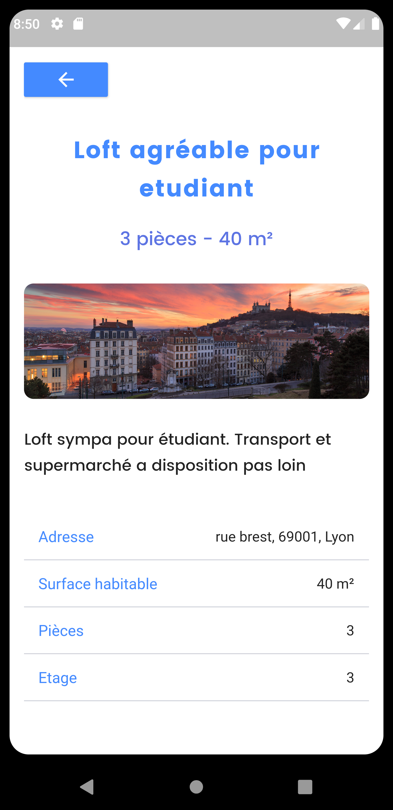

# YWYMobilier Mobile App

Une application mobile du site YWYMobilier, disponible à destination des étudiants seulement, qui peuvent regarder quand ils souhaitent les nouvelles annonces plus rapidement.

## Technologies Utilisées

Le framework : [Flutter](https://flutter.dev/)   
Le language : [Dart](https://dart.dev/)

## Fonctionnalités précises 

L'application mobile YWYMobilier récupère les données existante sur le site en ligne pour les afficher sur son application. 

##  Pour tester l'application 

La page de connexion/inscription ne servent à rien (au back derrière).
Appuyer sur le bouton SE CONNECTER pour accéder à l'application.
Vous pouvez naviguez via le menu en bas de l'écran et vous dirigez vers Offres pour consultez nos offres.

# Auteurs de l'application

[Florian BERROT](https://github.com/Flours06)  
[Steven COPY](https://github.com/theejkb)
